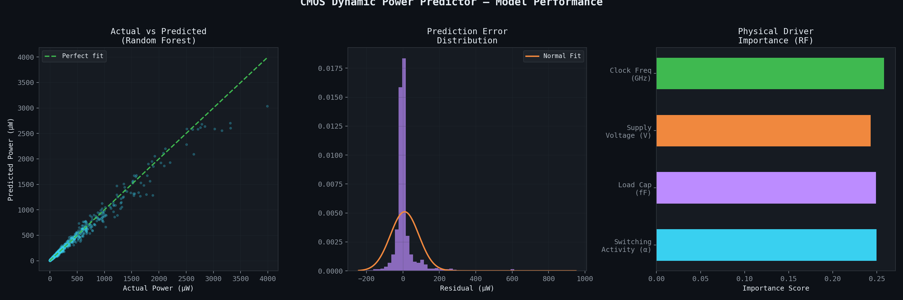
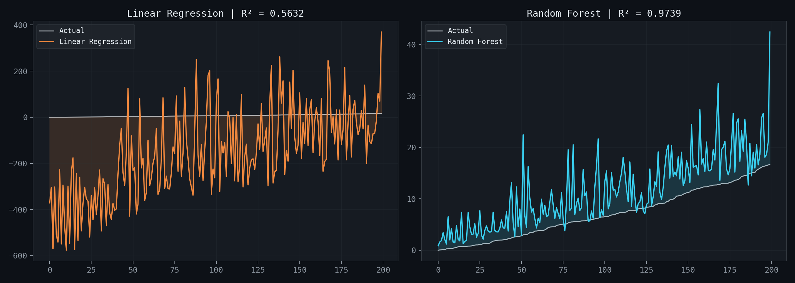
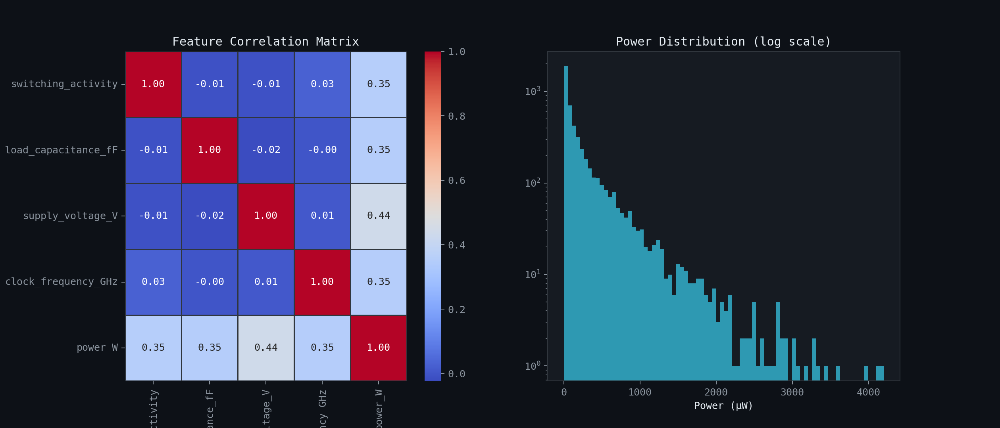
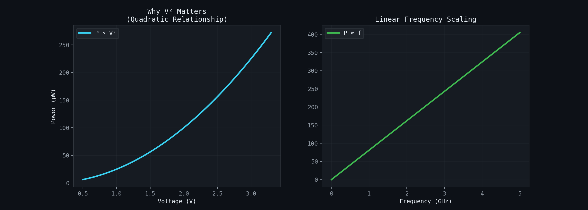
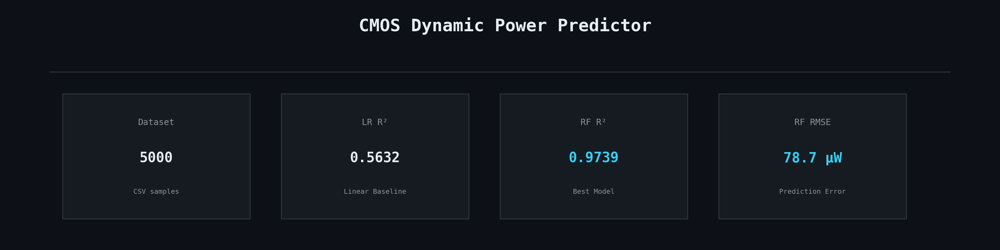

# CMOS Dynamic Power Consumption Predictor
**Project Overview:** This project explores the application of Machine Learning to predict dynamic power consumption in CMOS circuits based on the physical law:  
$$P = \alpha \cdot C \cdot V^2 \cdot f$$

## 1. Model Performance Summary

### Interpretation:
* **Actual vs. Predicted:** The Random Forest model shows high precision, with most data points tightly clustered around the "Perfect fit" line. 
* **Error Distribution:** The residuals are centered at zero and follow a narrow Gaussian distribution, proving that the model's errors are random and minimal rather than biased.
* **Physical Drivers:** As expected from the CMOS power equation, **Voltage** and **Frequency** emerge as the most influential features.

---

## 2. Linear Regression vs. Random Forest

### Interpretation:
* **Linear Regression ($R^2 \approx 0.56$):** This model struggles significantly because it attempts to fit a straight line to a quadratic ($V^2$) relationship. It consistently under-predicts high power states and over-predicts low ones.
* **Random Forest ($R^2 \approx 0.97$):** By using a non-linear approach, the Random Forest captures the true physical behavior of the CMOS inverter, resulting in nearly perfect tracking of the actual power consumption.

---

## 3. Dataset Analysis & Correlations

### Interpretation:
* **Correlation Matrix:** The heatmap reveals that while all features correlate positively with Power, **Supply Voltage ($V$)** has the strongest individual correlation (0.44). This validates $V$ as the most critical design parameter in power-sensitive VLSI.
* **Power Distribution:** The log-scale histogram shows that the majority of CMOS operations occur at lower power levels, with rare "high-switching" peaks, typical of real-world integrated circuits.

---

## 4. Physics Verification: Why the Model Works

### Interpretation:
This figure isolates the two most important relationships in CMOS design:
1. **Quadratic Scaling ($P \propto V^2$):** The curve clearly shows that doubling the voltage quadruples the power. This non-linearity is exactly why the Linear Regression model fails.
2. **Linear Scaling ($P \propto f$):** The relationship with frequency is a perfect straight line, showing that power consumption is directly proportional to the clock speed.

---

## 5. Final Summary Card

### Key Metrics:
* **Best Model:** Random Forest Regressor
* **Accuracy ($R^2$):** 0.9740
* **Error (RMSE):** ~78.6 µW
* **Conclusion:** Machine Learning, specifically tree-based models, can accurately "reverse-engineer" physical laws from circuit simulation data, making it a powerful tool for rapid power estimation in early-stage VLSI design.